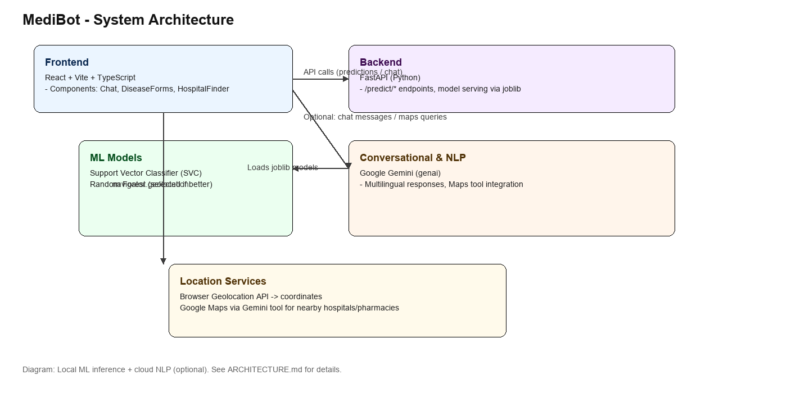
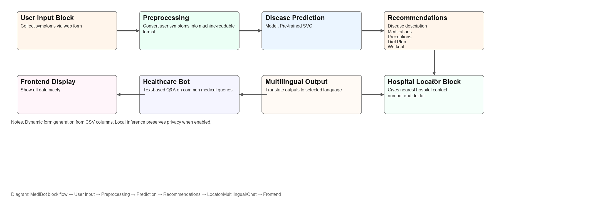

<div align="center">

</div>

# Run and deploy your AI Studio app

This contains everything you need to run your app locally.

View your app in AI Studio: https://ai.studio/apps/drive/1dtj_-9zkSg-RQqgcGBdexHfT9fsVYcAv

## Run Locally

**Prerequisites:** Node.js, Python 3.10+, and a virtual environment

1. Install frontend dependencies:

```powershell
npm install
```

2. Create and activate Python virtual environment, then install backend deps:

```powershell
python -m venv .venv
.\.venv\Scripts\python.exe -m pip install --upgrade pip
.\.venv\Scripts\python.exe -m pip install -r local_server\requirements.txt
```

3. Configure environment variables in `.env.local` (optional):
- `VITE_USE_LOCAL_SVC=true` — use local ML server for predictions
- `VITE_LOCAL_SVC_URL=http://127.0.0.1:8001` — local server URL
- `GEMINI_API_KEY` — (optional) if you want cloud conversational features

4. Start the local FastAPI server (ML inference):

```powershell
# Start from project root
.\.venv\Scripts\python.exe local_server\server.py
```

5. Start the frontend:

```powershell
npm run dev
```

6. Open the app: `http://localhost:3000`


## Project Overview

**MediBot** is a hybrid multilingual medical AI platform that combines local classical ML models (SVC / Random Forest) for disease prediction with cloud-powered conversational NLP (Google Gemini). Key features:

- Dynamic form generation from CSV datasets stored in `local_server/models/`
- Local model serving via FastAPI (`/predict/diabetes`, `/predict/heart`, `/predict/anemia`)
- Multilingual conversational responses and hospital search using Google Gemini tools
- Geolocation-based hospital/pharmacy discovery using the browser `navigator.geolocation` API and Gemini's Google Maps tool
- Analysis & visualization pipeline in `analysis/` (metrics, plots, PDF report)

## Documentation & Reports

- **Architecture:** [ARCHITECTURE.md](ARCHITECTURE.md)

<div align="center">
  <a href="ARCHITECTURE.md">
    
  </a>
</div>

- **Model & performance analysis:** See [analysis/README.md](analysis/README.md)
- **Generated report:** `analysis/MediBot_Performance_Report.pdf` (run `analysis/generate_pdf_report.py` to recreate)

- **Block diagram:** visual overview of MediBot components and data flow (generated)

<div align="center">
  <a href="docs/block_diagram.png">
    
  </a>
</div>

## Privacy Notes

- When `VITE_USE_LOCAL_SVC` is enabled, patient data for predictions remains on-device/local server and is not sent to cloud NLP services.
- Optional cloud features (conversational analysis / Google Maps lookups) use Gemini and may send text or coordinates to cloud services; disable them if strict local-only operation is required.

## Tests

- Quick endpoint check:

```powershell
$headers = @{ 'Content-Type' = 'application/json' }
$body = '{"features": [1,95,70,30,100,28.0,0.3,45] }'
Invoke-RestMethod -Method Post -Uri 'http://127.0.0.1:8001/predict/diabetes' -Headers $headers -Body $body
```

## Next Steps

If you want, I can:
- Add the architecture diagram image to `docs/`
- Add a short deployment guide for Docker/Kubernetes
- Improve the analysis PDF formatting or create an interactive HTML dashboard

---

If you'd like any of the above, tell me which and I’ll proceed.
